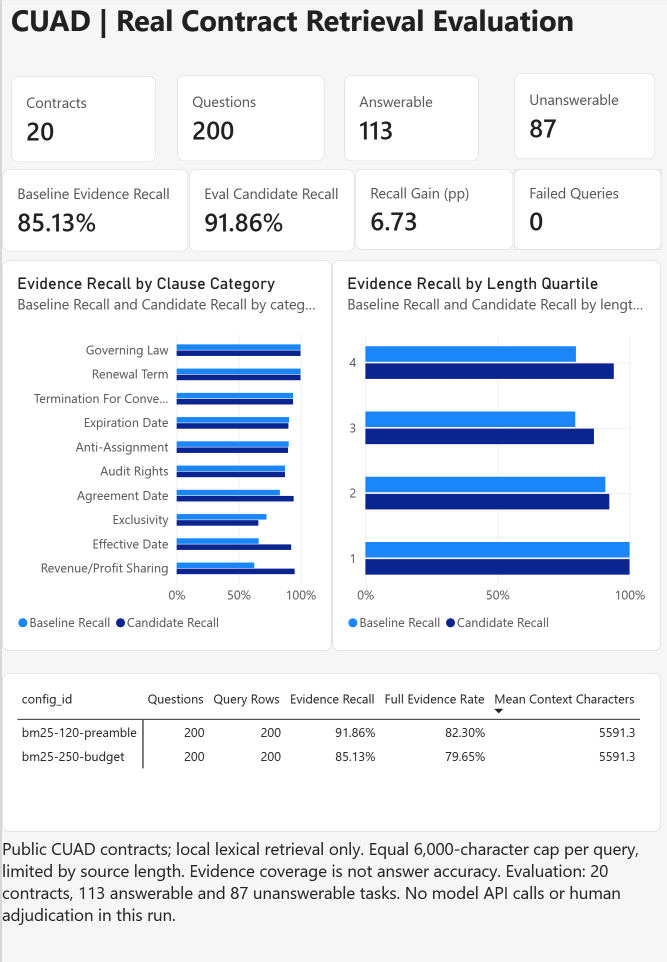
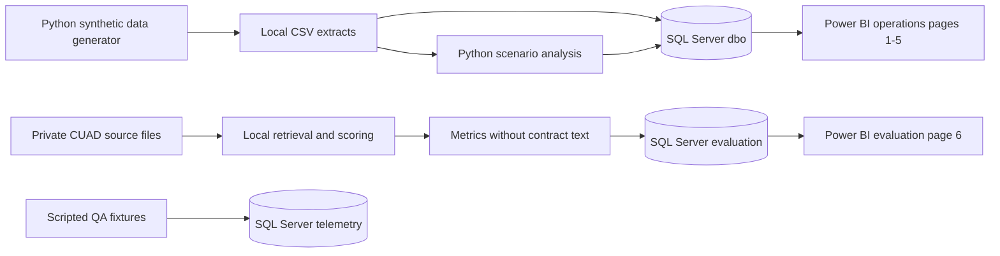

# Legal AI Operations Observatory

Helping a law firm understand how AI is used, what it costs and where human
review should come first.

This project brings usage, cost and review data into five operations pages,
with a sixth Power BI page for real-contract retrieval evaluation. Python and
SQL Server support the data workflow and evidence-quality comparisons.

**Stack:** Python, pandas, NumPy, SQL Server, T-SQL, Power BI, DAX, Power Query,
Docker and BM25.

[Case study and evidence](docs/PORTFOLIO_CASE_STUDY.md) |
[Power BI report](powerbi/legal-ai-observatory.pbix) |
[Real-contract results](docs/CUAD_BUDGET_V2.md)

## Key Results

- Built the reporting workflow around over 460,000 records covering 400 lawyers
  and 18 months of simulated operations.
- Built a 20-person review shortlist containing 13 members of the synthetic
  risk cohort (65% precision), compared with two for exposure-rate ranking (10%).
  The list supports human follow-up, not findings of misconduct.
- Improved mean evidence recall from 85.13% to 91.86% on 113 answerable tasks
  from 20 new CUAD contracts under the same context budget. Recall fell on nine
  tasks despite the higher overall mean.
- Reconciled 1,700 experiment result rows in SQL Server and verified that repeat
  imports added no duplicates.

## What Evaluation Changed

- **Governance:** Rejected sensitive-session exposure as the primary shortlist
  signal and kept it as context for human follow-up. The
  [synthetic comparison](docs/ALERT_RULES.md#screening-reference) favoured review
  completion over both exposure rate and their tested rank-sum combination.
- **Billable impact:** Limited claims about differences between fee arrangements
  because the hours model did not recover the simulated effect sizes.
- **Retrieval:** Kept v2 after sentence-boundary and stemming changes failed the
  predefined acceptance criteria, with their regressions retained in the record.

**Data and scope:** This is a personal prototype. Operations data is synthetic,
including the tool names and financial scenarios. CUAD supplies public contracts
for a separate local retrieval evaluation. Retrieval recall is not LLM answer
accuracy. There is no live provider integration, client deployment or measured
business saving. Source contracts and individual query logs remain private.
The PBIX includes per-task numerical evaluation results, answerability labels
and document/task IDs, but no contract text or annotated answer spans.


Headline KPIs, rule breaches and pipeline-health checks in the synthetic
operations report.

## My Contribution

The project connects legal workflow questions with metric definitions, a data
model and a working report. My work includes choosing what the report should
show, configuring Power BI and reviewing the results. I used AI assistance for
code, tests, documentation and debugging. The case study links each main claim
to its implementation or validation record.

## What I Built

| Component | Deliverable | Evidence |
|---|---|---|
| Data preparation | A scripted Python and SQL workflow for over 460,000 synthetic records covering 400 lawyers and 18 months | [Generator](src/generate.py), [SQL runner](sql/run_all.sh) |
| BI reporting | Six Power BI pages: five for synthetic operations and one for CUAD evaluation | [Model](docs/DATA_MODEL.md), [operations measures](powerbi/measures.dax), [evaluation measures](powerbi/cuad_measures.dax) |
| Operational analysis | Adoption, retention, licence use, output review, incidents and 16 configurable alert rules | [KPI catalogue](docs/KPI_CATALOGUE.md), [alert rules](docs/ALERT_RULES.md) |
| Retrieval evaluation | Controlled local experiments on public CUAD contracts with separate development and evaluation samples | [Protocol and results](docs/CUAD_BUDGET_V2.md) |
| Evaluation reporting | A separate SQL schema with 1,700 reconciled result rows across three runs and repeat-import protection | [SQL migration](sql/07_evaluation/01_retrieval_results.sql), [import code](src/cuad_warehouse.py) |
| Observability pilot | Request and attempt logs, versioned review records, and scripted failure and recovery tests | [Validation record](docs/OBSERVABILITY_VALIDATION.md) |

## Business Questions

- Which groups use AI, and where does adoption need further investigation?
- How do licence costs change the cost per accepted output?
- Is a fall in usage a behaviour change or a missing data feed?
- Where is mandatory review incomplete, and which cases need follow-up?
- Does a retrieval change find more evidence under the same context budget?

The [case study](docs/PORTFOLIO_CASE_STUDY.md) explains the metric choices,
findings and proposed actions.

## Power BI Report

The saved report contains six pages. Screenshot numbers are file identifiers,
not report page numbers: 06 is a list detail, 07 is the original operations
model, and 08 shows the sixth report page.

| Page | Focus | Preview |
|---|---|---|
| Executive Overview | Headline KPIs, alert status and pipeline health | [Screenshot](powerbi/screenshots/01-executive-overview.png) |
| Adoption & Retention | Monthly adoption, cohort retention and group comparisons | [Screenshot](powerbi/screenshots/02-adoption-retention.png) |
| Billable Impact | Estimated capacity and hourly revenue exposure under stated assumptions | [Screenshot](powerbi/screenshots/03-billable-impact.png) |
| Quality & Observability | Acceptance, edit distance, review coverage, errors and latency | [Screenshot](powerbi/screenshots/04-quality-observability.png) |
| Governance & Risk | Confidentiality tiers and a review priority list of up to 20 lawyers | [Screenshot](powerbi/screenshots/05-governance-risk.png), [list detail](powerbi/screenshots/06-screening-list.png) |
| Real Contract Evaluation | Equal-budget CUAD retrieval, clause categories, length groups and configuration comparison | [Screenshot](powerbi/screenshots/08-real-contract-evaluation.png) |

[Operations model view](powerbi/screenshots/07-model-view.png) |
[DAX definitions](powerbi/measures.dax) |
[Independent SQL checks](sql/05_validation/02_reporting_fixes.sql)

Checks on 9 September 2026 covered the saved six-page report, its 18 imported
tables, 14 evaluation measures and 1,700 cached evaluation rows. The evaluation
table has no relationships to the synthetic operations model. Earlier checks
covered the chronological adoption trend and the Top 20 filter. These checks
do not certify every Windows interaction or measure under arbitrary filters.

### Billable Impact

Separates estimated hourly revenue exposure from fixed-price capacity, with
the comparison group and uncertainty shown alongside the figures.


### Governance and Risk

A review-priority list based on mandatory review completion, with
sensitive-session exposure retained as context for human follow-up.


## Real-Contract Evaluation

A candidate was selected on ten development contracts, then compared with its
baseline on twenty additional CUAD contracts. Each query used the same cap of
6,000 unique source characters. The two configurations returned exactly matched
context lengths for each task.

| Metric on the new evaluation sample | Baseline | Candidate |
|---|---:|---:|
| Contracts / tasks | 20 / 200 | 20 / 200 |
| Tasks with annotated evidence | 113 | 113 |
| Mean gold-character recall | 85.13% | 91.86% |
| Complete evidence coverage | 79.65% | 82.30% |
| Mean retrieved characters across all tasks | 5,591.3 | 5,591.3 |

The mean recall gain was **6.73 percentage points**. Of the 113 answerable tasks,
15 improved, nine regressed and 89 were unchanged. All 87 unanswerable tasks
were retained. See the
[experiment record](docs/CUAD_BUDGET_V2.md) and
[aggregate results](results/cuad_budget_v2.json).

The evaluation page compares equal-budget retrieval by clause category and
contract length, including categories where the candidate performs worse.



Two later development experiments tested sentence boundaries and stemming.
Both failed the predefined acceptance criteria, so neither replaced v2. Their
[boundary results](docs/CUAD_BOUNDARY_ABLATION.md) and
[stemming results](docs/CUAD_STEMMING_ABLATION.md) retain the regressions.

## Architecture



The three SQL schemas keep simulated operations, retrieval results and fixture
telemetry separate. Contract text and gold answer spans are not imported into
the evaluation schema. Numeric labels and evidence metrics are stored there.

## Validation and Limits

- **Local software checks:** 169 offline tests passed on 9 September 2026.
  Synthetic consistency checks also passed on 8 September. These test software behaviour
  and designed scenarios, not real-world model quality.
- **Recorded SQL validation:** All 1,700 evaluation rows reconciled with Python.
  Repeating each import inserted zero rows. Six evaluation SQL integration tests
  passed in the earlier database validation. SQL tests were not rerun for this
  documentation update.
- **Pending evaluation work:** The observability drills use local fixtures.
  Genuine human review and live-provider evaluation remain open.
- **Deployment:** Power BI Service publishing, scheduled refresh and production
  access controls are outside the validated scope. The original bulk-load path
  still needs explicit constraint-enforcement hardening.

The [release checklist](docs/RELEASE_CHECKLIST.md) records the public file scope
and remaining presentation checks.

## Run Locally

Screenshots and aggregate results can be reviewed without running the project.
Rebuilding the data requires Python and a local SQL Server environment. Editing
the report requires Windows Power BI Desktop.

### Python Analysis

Run from the repository root. These commands regenerate local extracts and
analysis outputs, including the two result CSV files.

```bash
python -m venv .venv
.venv/bin/pip install pandas numpy
.venv/bin/python src/generate.py
.venv/bin/python src/consistency_checks.py
.venv/bin/python src/billable_impact.py
.venv/bin/python src/screening_eval.py
```

The base pandas and NumPy dependencies are not fully locked. The CUAD extensions
have separate dependency files and reproduction instructions.

### SQL Server

The [SQL runner](sql/run_all.sh) targets an existing container named
`mssql-legalai` by default. It expects the extracts at `/data/raw` in that container
and `MSSQL_SA_PASSWORD` in the local environment or ignored `.env` file.
The [.env.example](.env.example) lists the configuration names without secrets.

**Use a disposable project database.** The runner rebuilds the original schema
and reloads its tables. It can overwrite local data and is not a production
migration. It also does not apply the separate telemetry and evaluation migrations.

```bash
./sql/run_all.sh
```

See the [SQL layer](docs/SQL_LAYER.md) for the original warehouse,
the [observability guide](docs/OBSERVED_RUNS.md) for telemetry, and
the [CUAD handoff](docs/CUAD_BUDGET_V2.md) for evaluation imports and Power BI assets.

### Offline Tests

Install the extension dependencies before running their tests.

```bash
.venv/bin/pip install -r requirements-observability.txt -r requirements-cuad.txt
.venv/bin/pip install --no-deps --require-hashes -r requirements-cuad-boundaries.txt
.venv/bin/pip install --no-deps --require-hashes -r requirements-cuad-stemming.txt
env PYTHONPATH=tests .venv/bin/python -m unittest \
  test_alert_catalogue \
  test_cuad_stemming test_cuad_boundaries test_cuad_failure_analysis \
  test_cuad_budget test_cuad_warehouse test_cuad_experiment \
  test_evidence_eval test_cuad_intake test_cuad_prepare test_observability
```

## Data Use

CUAD is curated by [The Atticus Project](https://www.atticusprojectai.org/cuad/).
The repository publishes implementation details, aggregate experiment results
and a reviewed PBIX with numerical per-task metrics. It does not redistribute
the downloaded dataset, source contracts, gold quotations or individual query logs.

[Attribution](docs/THIRD_PARTY_DATA.md),
[data governance](docs/DATA_GOVERNANCE.md) and
[intake checks](docs/CUAD_INTAKE_REVIEW.md) document the source and use boundaries.
External model processing requires a separate data-use review.

## Copyright and Permissions

Copyright 2026 Miao Ni. **All rights reserved.** This repository is a public
portfolio, not an open-source license grant. Use, copying, modification,
redistribution or commercial use of original project code, documentation and
report definitions requires prior written permission, except where permitted
by applicable law or GitHub's Terms of Service. See the [copyright notice](LICENSE).

GitHub's platform rights to view and fork public repositories still apply.
Third-party datasets, annotations and dependencies retain their own terms.
This includes CUAD-derived labels embedded in the PBIX. The project does not
claim ownership of CUAD material or restrict rights its publisher grants.
See the [third-party data notice](docs/THIRD_PARTY_DATA.md).

## Further Reading

| Topic | Document |
|---|---|
| Decisions, findings and claim evidence | [Portfolio case study](docs/PORTFOLIO_CASE_STUDY.md) |
| Schema and scenario assumptions | [Data model](docs/DATA_MODEL.md) |
| KPI definitions and caveats | [KPI catalogue](docs/KPI_CATALOGUE.md) |
| Report measures | [DAX documentation](docs/DAX_MEASURES.md) |
| Original Top 3 and Top 5 experiment | [CUAD v1 results](docs/CUAD_REAL_DATA_RESULTS.md) |
| Equal-budget experiment and SQL reporting | [CUAD v2](docs/CUAD_BUDGET_V2.md) |
| Multi-span evidence scoring | [Evidence evaluation](docs/EVIDENCE_EVALUATION.md) |
| Scripted observability pilot | [Observed runs](docs/OBSERVED_RUNS.md) |
