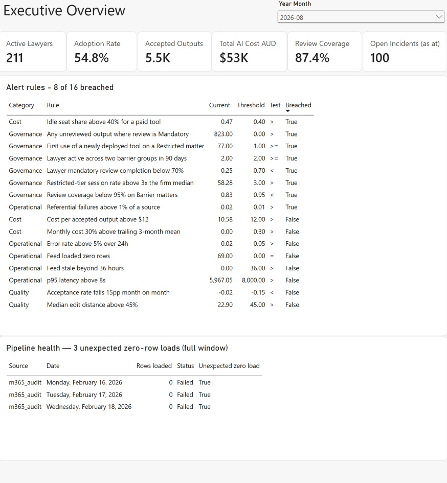
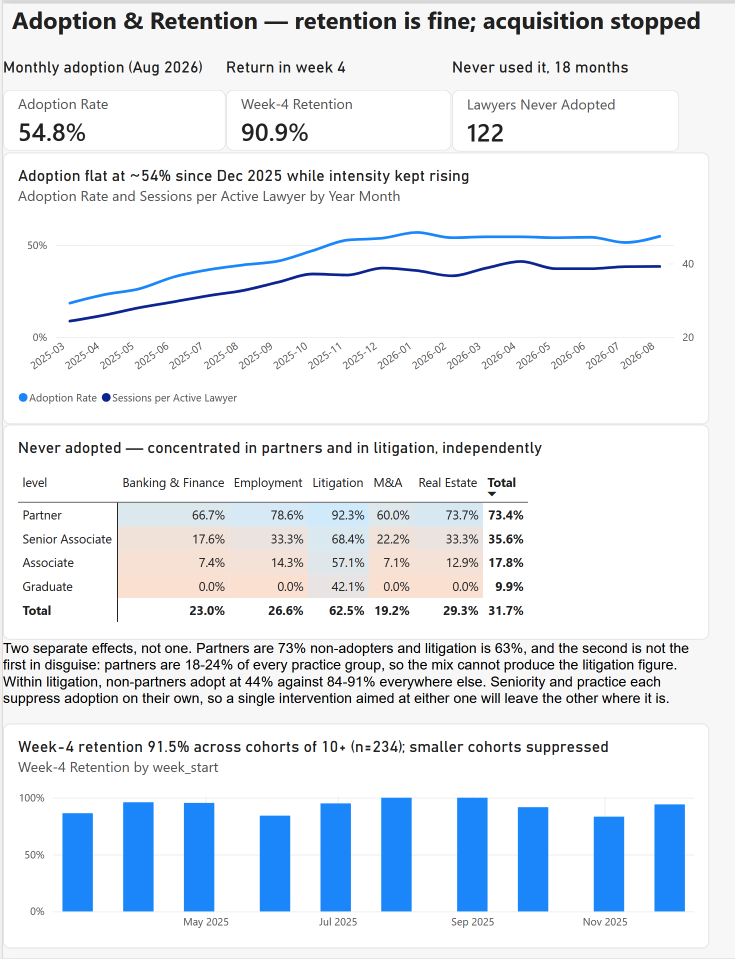
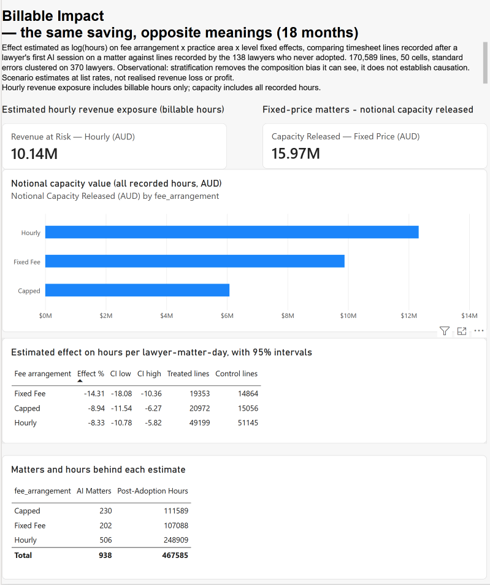
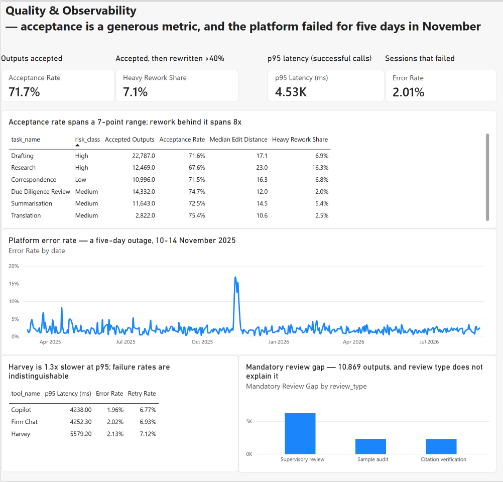
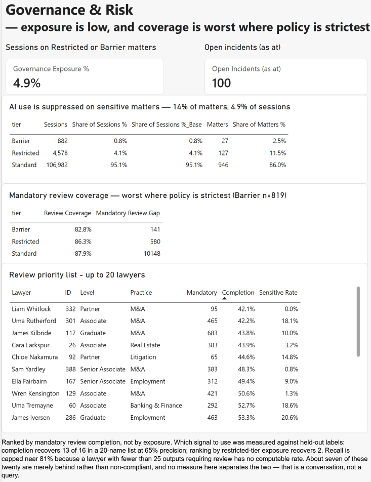
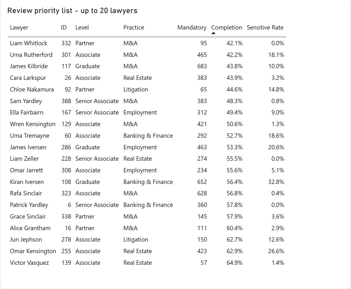
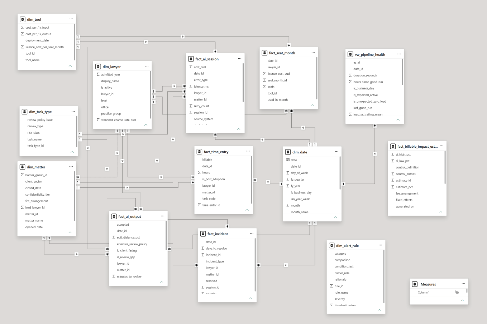
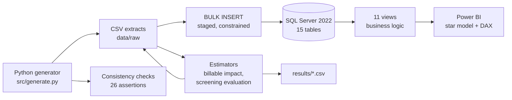

# Legal AI Operations Observatory

A monitoring system for a law firm's AI tooling — adoption, quality, running
cost, and governance — built on a synthetic warehouse of 466,000 rows.

**Status.** Complete. Generator, SQL layer, estimators and a five-page Power BI
report, reproducible end to end from `src/generate.py` through `sql/run_all.sh`.

**Reporting corrections checked (7 September 2026).** Updated report screenshots
match the SQL checks: 8 of 16 rules breached and AUD 10.14m of estimated Hourly
revenue exposure using billable hours. The saved PBIX binds the alert title to
a measure and distinguishes revenue exposure from all-hours capacity estimates.
The adoption chart now sorts chronologically, and the governance screenshot's
20 unique lawyer IDs match the Python screening reference list.

---

## The report

Five pages. `powerbi/legal-ai-observatory.pbix`; every measure in
`powerbi/measures.dax`, and every measure's expected value in
`sql/05_validation/01_dax_expected_values.sql`.

### 1 — Executive Overview



Six headline numbers, the sixteen alert rules evaluated against current data,
and the pipeline health strip. The adoption denominator here is the one that
took two attempts to get right — see *A defensive filter that removed the thing
being measured*, below.

### 2 — Adoption & Retention



Adoption climbed from 18.4% to 54.8% and then sat flat for ten months. Week-4
retention is 90.9%, so the plateau is not churn: the last first-time user
appears in March 2026. Acquisition stopped. The matrix separates two
independent causes — seniority and practice group — that a single adoption
number blends together.

### 3 — Billable Impact



A fixed-effects estimate with lawyer-clustered standard errors, stated with its
control group and its interval, beside the three simpler estimators that get
the sign or the magnitude wrong. Released capacity is reported as capacity, not
as margin.

### 4 — Quality & Observability



Output quality on the left, platform health on the right. Acceptance rate puts
research and due diligence review seven points apart; the share of accepted
output later rewritten by more than 40% puts them eight times apart. The
five-day November outage is invisible when error rate is cut by tool and
obvious when it is cut by day.

### 5 — Governance & Risk



Exposure is low — 14% of matters carry a restricted tier but only 4.9% of
sessions land there — and review coverage is worst exactly where policy is
strictest. The page ends in a short list of names.



The list is scored against held-out labels rather than asserted: about 65%
precision at twenty names, recall capped near 81%. Roughly seven of the twenty
are behind rather than non-compliant, and no measure on the page separates the
two.

### The model



---

## The question this answers

A firm rolls out Harvey, Copilot and an internal chat tool to 400 lawyers. Six
months later someone has to stand up in a partnership meeting and say how it is
going.

"Monthly active users" cannot answer that. It cannot tell you that graduates are
nearly four times as likely as partners to touch a tool in a given month, and
need a different rollout; that
litigation output is rewritten three times as much as M&A output, so the same
acceptance rate means different things; that the hours AI saves are a margin
story on fixed-fee work and a **revenue story** on hourly work, pointing in
opposite directions; or that the review coverage a compliance team relies on is
worst exactly where the confidentiality tier is strictest.

Those are the questions an AI operations function actually gets asked. This
project is an attempt to define metrics that answer them, and then to check
whether the metrics survive contact with data.

---

## Why these metrics

This is the part of the project that matters. Each choice below is a decision
that a generic usage dashboard gets wrong.

### Adoption is only meaningful stratified

A firm-wide adoption rate averages together populations with unrelated problems.
Graduates reach 77% monthly active; partners reach 22%. Those are not the same
programme at two speeds — they are a training problem and an incentive problem,
and one number hides both. Every adoption measure here is reported by level ×
practice group, and the denominator is built from the lawyer dimension rather
than the session table, so a group with no users reports zero instead of
disappearing from the visual.

Stratifying raises a question it also has to answer. Over the full window 73.4%
of partners and 62.5% of the litigation group never used the tools at all,
and the second figure would be an artefact if partners were simply concentrated
in litigation. They are not: partners are between 17.7% and 24.3% of every
practice group, and within litigation the non-partners adopt at 44.1% against
84.1–91.1% elsewhere. Seniority and practice suppress adoption independently,
which is the difference between one intervention and two.

### Billable impact has to be split by fee arrangement

The economic unit of a law firm is the billable hour, which makes saved time
ambiguous rather than good:

| Fee arrangement | Estimated hours released | Valued at charge-out rate | What it means |
|---|---|---|---|
| Hourly, billable only | 18,820 | **AUD 10.14m** | estimated revenue exposure, not realised loss |
| Fixed Fee | 17,883 | AUD 9.9m | capacity released |
| Capped | 10,955 | AUD 6.1m | capacity released |

Hourly revenue exposure excludes non-billable time. Fixed Fee and Capped
capacity includes all recorded time; its conversion to income depends on
redeployment and the fee agreement. These are scenarios based on fitted effects
and list rates, not measured changes in billed or collected revenue. A single
firm-wide "AI saved N hours" headline cannot express these differences.

### Released capacity is not margin

Hours saved on a fixed-price matter do not become profit by themselves. They
become capacity, and convert to profit only if reinvested in chargeable work — a
lawyer who saves ten hours and leaves at five has improved nothing. The measure
is therefore named **Notional Capacity Released**, and it is never shown without
the reallocation ratio beside it. In this dataset **41%** of released hours
reappear as recorded time elsewhere. The other 60% went nowhere, which is the
finding, not a rounding error.

### Edit distance beats usage counts as a quality signal

"Accepted" is a generous binary: a lawyer who rewrites 60% of a draft still
clicked accept. The median share rewritten separates practice areas that usage
counts cannot — 33.0% in Litigation against 11.1% in M&A. It separates task
types more sharply still. Acceptance puts research and due diligence review
seven points apart, 67.6% against 74.7%; among the outputs each of them had
accepted, 16.3% of research was then rewritten by more than 40% against 2.0%
of due diligence review. Asking a model to compose and asking it to retrieve
are not equally reliable, and acceptance rate is structurally unable to say
so. Review coverage is
reported split by review type as well, because verifying a citation and
supervising a draft are different risks with different failure modes, and a
blended "review coverage" hides whichever one is failing.

### Cost is licences, and it is per accepted output

Token spend across eighteen months is **AUD 6,670**. Licence spend is **AUD
787,710** — tokens are 0.8% of what the firm pays. A cost page built from the
session table alone is wrong by two orders of magnitude and reports a programme
that appears to cost nothing.

Once licences are counted the unit cost becomes legible: **AUD 10.58 per
accepted output** firm-wide, and AUD 28.14 for the most expensive tool against
AUD 2.56 for the cheapest. Cost per *call* would have rewarded a tool that is
cheap and useless.

And the seat fact answers a question the session table cannot: **AUD 401,570 —
51% of the licence bill — bought seats nobody opened in the month they were paid
for.** Seats are allocated at rollout and renewed annually; usage is checked, if
at all, by someone glancing at a session count. This is the cheapest problem on
the dashboard to fix, because unlike adoption it needs no behaviour change from
anyone, only a reconciliation before renewal.

### Confidentiality tier needs its own page

AI use is heavily suppressed on sensitive matters — 14% of matters carry a
Restricted or Barrier tier, but only 4.9% of sessions land there. Most lawyers
self-restrict. The problem is the small number who do not, and no adoption or
quality metric surfaces them.

### Alert rules split operational from governance, and say why

The catalogue holds 16 rules across four categories, and the reason the
governance thresholds are tighter travels with the alert in a `rationale`
column. An operational rule tolerates a few percent of failure because the cost
of a failure is a lawyer's wasted minute. A barrier-coverage rule does not,
because the cost of a failure is privileged information crossing an information
barrier — not recoverable, and reportable. A tolerance that is sensible for
latency is negligent for a barrier.

Thresholds are stored as data, not code: `vw_alert_status` computes each rule's
current value and applies the operator from the dimension, so changing a
threshold is a row update.

---

## What the data said back

Three of the intended findings did not survive being measured. Those are the
most useful results in the project.

### The obvious estimator for billable impact has the wrong sign

Comparing total hours on AI-assisted matters against other matters gives
**+41%**: matters that attract AI are simply bigger. Three estimators were tried
before one held up.

| Estimator | Result |
|---|---|
| Total hours per matter, AI vs rest | +41%, wrong sign — selection |
| Before vs after first use, same matter | uncomputable: 39% of AI lawyer-matters have no pre-period, median one timesheet line |
| Control = the same lawyers' other matters | contaminated — reinvested capacity lands there |
| **Control = lawyers who never adopted** | −8.9% / −14.3% / −8.3% |

The surviving estimate is `log(hours)` on fee arrangement × practice area ×
level fixed effects across 170,589 timesheet lines, with standard errors
clustered on the lawyer. Clustering is not optional: timesheet lines within a
lawyer are strongly correlated, and classical intervals here are narrower by
about an order of magnitude, which would make every pair of fee arrangements
look separable.

Fixed-fee work is distinguishable from hourly (−6.5pp, 95% CI [−11.3, −1.5])
and from capped (−6.3pp, [−0.9, −11.9]); capped and hourly are not
distinguishable from each other (−0.7pp, [−4.5, +3.4]), which is correct — they
differ by 1pp in the design. So the page separates fixed-price from hourly work
and declines to rank capped against hourly.

The estimate is stored in `fact_billable_impact_estimate` with its control
definition, cell count, cluster count and interval, because **an effect size
without its control group is not a finding** — and a schema that stored only the
point estimate would break that rule by construction.

### The intuitive governance screen barely works

The synthetic data contains a small population of lawyers who ignore the
confidentiality policy. Their label is generated but never published, which
makes the screening rule itself measurable — which signal recovers them, at what
cost in false positives.

| Screen, 20 names | Precision | Recall | Average precision |
|---|---|---|---|
| **Mandatory review completion** | **65%** | **81%** | **0.88** |
| Restricted-tier session rate | 10% | 13% | 0.13 |
| Restricted-tier session count | 20% | 25% | 0.16 |
| Both, rank-summed | 10% | 13% | 0.08 |

Exposure — the signal that reads as obviously right — barely separates them,
because how much sensitive work a lawyer is *staffed on* dominates how much they
choose to use AI on it. Combining the two signals is worse than the strong one
alone. And recall is capped at 81% by the rule rather than the ranking: three of
the sixteen record too few outputs requiring review for any rate to exist, so
light users are invisible to any rate-based screen.

The honest answer to "how accurate is this list?" is **about two thirds right**:
13 genuinely non-compliant and 7 merely careless — and no measure in the model
separates the two. Telling "ignored the policy" from "meant to and
never got to it" is a conversation, not a query. The threshold is set to
over-collect for that reason.

### A naive data-quality rule fires 586 times

"A feed loaded zero rows" sounds like an unambiguous failure. Every feed loads
nothing at weekends, and the Harvey feed loads nothing before it was deployed —
so written naively the rule fires on **586 days** in an 18-month window and gets
switched off in a week. Scoped to days a source was expected to be carrying
traffic, it fires on **3**: exactly the outage planted in the data.

---

## Architecture



Business logic lives in views; Power BI presents. The one exception is the
billable-impact effect, which is a fixed-effects regression that no view can
express and no DAX measure should pretend to — it is fitted in Python and landed
as a small result table with its provenance attached.

`./sql/run_all.sh` rebuilds the entire database from the extracts in about eight
seconds.

---

## The synthetic dataset

400 lawyers over 18 months (March 2025 – August 2026), covering one complete
Australian financial year. Six dimensions, five fact tables, one result table.

| Table | Rows |
|---|---:|
| `fact_time_entry` | 226,082 |
| `fact_ai_session` | 112,442 |
| `fact_ai_output` | 104,637 |
| `fact_seat_month` | 16,863 |
| `fact_pipeline_run` | 1,647 |
| `dim_matter` | 1,100 |
| `dim_date` | 730 |
| `fact_incident` | 450 |
| `dim_lawyer` | 400 |
| `dim_alert_rule` | 16 |

Nine behavioural patterns are built into the generator — adoption falling with
seniority, transactional work adopting faster than contentious, contentious
output being edited more, the fee-arrangement asymmetry, a governance anomaly, a
service outage, a chronic data-quality defect, incidents tracking poor review
coverage, and licence seats allocated at rollout to people who never used them.

**These are assumptions, not observations.** They were set from five years in
practice as a corporate and capital markets lawyer, and `docs/DATA_MODEL.md`
lists the three that a reader should challenge first — charge-out rates, review
policy, and the confidentiality tier distribution — with the basis for each and
how it would differ between firms.

`src/consistency_checks.py` verifies all of it: 26 assertions covering whether
each pattern is present at the intended magnitude, and whether the patterns
interfere with each other. Generation is byte-reproducible from a fixed seed.

The generator also documents where the realised data differs from the design.
Adoption in M&A is 2.1× litigation against an intended 2.5×, because adoption is
bounded at 100% and a multiplicative model compresses near the ceiling. The
realised figure is the one quoted everywhere else.

---

## Data quality monitoring

The pipeline layer models ingestion, and **the rows it reports as lost are
actually absent from the fact table.** A three-day feed outage removes those
sessions; a chronic 2% referential mismatch on another source silently drops
rows throughout. A monitoring page that reports a failure while every downstream
fact remains intact is theatre.

The consequence is that the adoption dip in February 2026 is not real, and
nothing but the pipeline health strip can explain it. That is the point: silent
undercount is more dangerous than a loud outage, because every metric downstream
is quietly wrong and nothing looks broken.

---

## Two measures worth reading

Both of these were found by checking every measure against a value computed
independently in SQL, which is the only reason either was caught.

### A defensive filter that removed the thing being measured

Adoption rate needs a denominator the fact table cannot narrow: the population
of a group has to include the lawyers who never opened the tool. The obvious
way to write that — and the way it is usually suggested — is to clear the fact
table's filters:

```dax
Lawyer Population =
CALCULATE (
    DISTINCTCOUNT ( dim_lawyer[lawyer_id] ),
    KEEPFILTERS ( dim_lawyer[is_active] = TRUE () ),
    REMOVEFILTERS ( fact_ai_session )      -- wrong
)
```

In DAX a table's *expanded table* includes the columns of every table reached
through a many-to-one relationship, so `fact_ai_session` expanded contains
`dim_lawyer`, `dim_matter`, `dim_date`, `dim_tool` and `dim_task_type`.
`REMOVEFILTERS` on the fact clears all of them. Grouped by level, the
denominator returned the whole active firm on every row:

| Level | Shown | Correct |
|---|---|---|
| Graduate | 0.16 | 0.78 |
| Associate | 0.22 | 0.62 |
| Senior Associate | 0.12 | 0.52 |
| Partner | 0.04 | 0.22 |
| **Total** | **0.55** | **0.55** |

The total was right, which is what let it survive a first look — and the
stratified rows were wrong, which is the only part of this metric that means
anything. A line added to protect the denominator had removed the ability to
stratify, and the page still looked plausible.

The fix is to delete the line. Every relationship in this model runs one way,
dimension to fact, so a filter on the session table cannot reach `dim_lawyer`
and no protection was needed. The same function on a *dimension* is safe —
`REMOVEFILTERS ( dim_date )` is what makes `Open Incidents (as at)` ignore the
month slicer, because a dimension's expanded table is only itself.

### A ratio stored as a column, and the alert it raised

Cost per accepted output is a ratio of two sums and has to be evaluated at the
grain of the visual. Stored per tool as a column and aggregated, it gives:

| | Value | |
|---|---|---|
| Correct — ratio of sums | **AUD 10.58** | |
| Column, summed | 39.01 | obviously broken |
| Column, averaged | **13.00** | **crosses the $12 alert threshold** |

The averaged version is the dangerous one. It is close enough to the true
figure to pass a glance, it is wrong because it weights a tool with 800 accepted
outputs the same as one with 45,000, and it sits on the wrong side of a
threshold in the alert catalogue. The broken measure raises a cost alert that
the correct measure does not.

---

## Limitations

- **The data is synthetic and the patterns are assumptions.** Nothing here is
  evidence about how real firms behave.
- **Every effect is observational.** Stratification removes the composition bias
  it can see. It does not establish causation, and no page claims it does.
- **One estimate is knowingly biased.** The Fixed Fee effect overshoots its
  designed value by about 3pp, because the non-adopter control is thinnest
  exactly where fixed-price work concentrates. The direction is trustworthy;
  the size of the gap is not. On real data this would be invisible — it is
  visible here only because the ground truth is known, which is a reason to
  build methods against synthetic data before trusting them on real data.
- **Real firms differ.** Timekeeping granularity, matter taxonomies and
  confidentiality tiering vary widely, and most firms have not yet written down
  a review policy for AI output at all.
- **No user research.** Nobody has been interviewed to check whether these are
  the metrics a firm's management actually wants. That is the first thing that
  would change on contact with a real one.

---

## On the tooling

SQL Server and Power BI are recent for me. I learned both over the past weeks
specifically to think about this problem properly, and this repository is that
practice — it is not equivalent to years of production BI work, and I would not
describe it that way in an interview.

What is not recent is the domain. The metric design, the review-policy model,
the fee-arrangement asymmetry and the confidentiality tiering come from five
years practising as a corporate and capital markets lawyer. That is the half of
this problem I did not have to learn for the project, and it is the half that
decides whether the dashboard asks useful questions.

---

## Running it

```bash
python -m venv .venv && .venv/bin/pip install pandas numpy

.venv/bin/python src/generate.py             # 12 tables -> data/raw/*.csv
.venv/bin/python src/consistency_checks.py   # 26 assertions, non-zero exit on failure
.venv/bin/python src/billable_impact.py      # fitted effect + intervals
.venv/bin/python src/screening_eval.py       # governance screen evaluation
.venv/bin/python src/export_alert_rules.py   # docs/ALERT_RULES.md
.venv/bin/python src/export_dax.py           # powerbi/measures.dax

docker run -d --name mssql-legalai --platform linux/amd64 \
  -e ACCEPT_EULA=Y -e MSSQL_SA_PASSWORD='<password>' -e MSSQL_MEMORY_LIMIT_MB=2048 \
  -p 1433:1433 -v "$(pwd)/data/raw:/data/raw" \
  mcr.microsoft.com/mssql/server:2022-latest

./sql/run_all.sh                             # schema, load, views, procedure
```

| Document | |
|---|---|
| `docs/DATA_MODEL.md` | schema, the eight patterns, intended vs realised, assumptions requiring practitioner judgement |
| `docs/KPI_CATALOGUE.md` | every metric: question, formula, grain, caveats, owner |
| `docs/SQL_LAYER.md` | views, constraints, what the SQL layer found |
| `docs/DAX_MEASURES.md` | every measure, the DAX, and the value it must return |
| `powerbi/measures.dax` | the 42 measure definitions alone, paste-ready (generated) |
| `docs/ALERT_RULES.md` | the 16 rules with the reasoning behind each threshold (generated from `dim_alert_rule`) |
| `results/` | committed evaluation artefacts |
