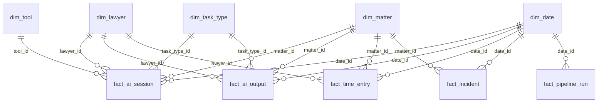

# Data Model

Dimensional model for a synthetic legal-AI operations warehouse: 6 dimensions,
6 operational fact tables and 1 fitted result table.
All data is synthetic. The behavioural patterns encoded in it are **assumptions
drawn from legal practice experience, not observations** — see §5.

## 1. Scope and volume

| Parameter | Value |
|---|---|
| Lawyer population | 400 |
| Observation window | 2025-03-01 → 2026-08-31 (18 months) |
| Australian financial years covered | FY2025 (part), FY2026 (complete), FY2027 (part) |
| Offices | Sydney, Melbourne, Brisbane, Perth |
| AI tools | Harvey, Copilot, Firm Chat |

Current CSV extracts, checked on 8 September 2026:

| Table | Rows | Grain |
|---|---|---|
| `dim_lawyer` | 400 | one lawyer |
| `dim_matter` | 1,100 | one matter |
| `dim_tool` | 3 | one tool |
| `dim_task_type` | 6 | one task type |
| `dim_date` | 730 | one calendar day (padded past the window) |
| `dim_alert_rule` | 16 | one monitoring rule |
| `fact_ai_session` | 112,442 | one AI session |
| `fact_ai_output` | 104,637 | one output produced by a session |
| `fact_time_entry` | 226,082 | one lawyer × matter × day timesheet line |
| `fact_incident` | 450 | one logged incident |
| `fact_pipeline_run` | 1,647 | one source system × ingest day |
| `fact_seat_month` | 16,863 | one licensed seat × month |
| `fact_billable_impact_estimate` | 3 | one fee arrangement — a fitted result, not an observation |
| **Total** | **464,379** | Excludes database snapshots and ETL logs |

`fact_time_entry` is larger than `fact_ai_session`. That is expected and fine:
timesheets are recorded daily per matter, and Import-mode Power BI is unbothered
by 250k rows. The binding constraint is refresh **across the VM boundary**, not
row count.

## 2. Schema



### Dimensions

**`dim_lawyer`** — 400 rows
| Column | Type | Notes |
|---|---|---|
| `lawyer_id` | INT PK | |
| `display_name` | NVARCHAR(80) | synthetic |
| `level` | VARCHAR(20) | Partner / Senior Associate / Associate / Graduate |
| `practice_group` | VARCHAR(40) | aligns to `dim_matter.practice_area` |
| `office` | VARCHAR(20) | Sydney / Melbourne / Brisbane / Perth |
| `admitted_year` | INT | |
| **`standard_charge_rate_aud`** | DECIMAL(9,2) | **added** — notional list charge-out rate per hour |
| `is_active` | BIT | |

> `standard_charge_rate_aud` is not decoration. Page 3's conclusion is that saved
> hours are *released capacity* on fixed-price matters and *lost revenue* on
> hourly ones. Without a rate, that page can only report "−9% hours", which no
> partner will act on. With it, the same hours convert to dollars and the two
> signs become visible. The name matters: charge-out rate is revenue/WIP value,
> not internal cost — treating it as cost is a category error.
>
> | Level | Rate (AUD/hr) |
> |---|---|
> | Partner | 1,150 |
> | Senior Associate | 720 |
> | Associate | 520 |
> | Graduate | 330 |
>
> ±12.5% individual variation. Partner:Graduate ≈ 3.5:1, so that "an hour of
> partner time released" and "an hour of graduate time released" are visibly
> different amounts on Page 3.
>
> **Top-tier charge-out rates are not publicly published.** These figures are a
> synthetic proxy calibrated from practitioner judgement, expressed as notional
> list rates, GST-exclusive; real matters are billed at negotiated client rates
> below list. No public rate source is cited, because the published Australian
> rate cards that can be found belong to small and boutique firms and are the
> wrong reference class for a top-tier practice. **No source is better than the
> wrong source.**
>
> The rate is held constant across the 18-month window. Real firms lift rates at
> the start of each financial year; modelling that would make AUD trends on
> Page 3 partly a pricing artefact. Noted in Limitations.

**`dim_matter`** — ~1,100 rows
`matter_id` PK · `matter_name` · `practice_area` · `client_sector` ·
`fee_arrangement` (Hourly / Capped / Fixed Fee) ·
`confidentiality_tier` (Standard / Restricted / Barrier) ·
`barrier_group_id` (nullable, populated only for Barrier tier) ·
`lead_lawyer_id` · `opened_date` · `closed_date` (nullable)

**Practice area mix**: Litigation 22% · Real Estate 22% · M&A 20% ·
Banking & Finance 18% · Employment 18%.

Real Estate and Employment carry deliberately high weight. Both use fixed and
capped fees more than the rest — high frequency, well-defined scope — so
weighting them up is both more realistic *and* the thing that keeps Page 3's
non-hourly cells large enough to compare.

**Confidentiality tier**: Standard 85% / Restricted 12% / Barrier 3%, assigned
independently of practice area. That independence is deliberate: if barrier work
concentrated in one group, Page 5 would read as a departmental problem rather
than an individual-behaviour one, which is not the finding the data is built to
support.

**Fee arrangement, conditional on practice area:**

| Practice area | Hourly | Capped | Fixed Fee |
|---|---|---|---|
| Litigation | 85% | 12% | 3% |
| Banking & Finance | 55% | 30% | 15% |
| M&A | 50% | 30% | 20% |
| Employment | 45% | 20% | 35% |
| Real Estate | 35% | 25% | 40% |
| **Firm-wide** | **≈54%** | **≈23%** | **≈23%** |

Capped fee is kept as its own category rather than folded into Fixed Fee. It is
the more common compromise in top-tier commercial work, and it behaves
differently: the downside is capped but the upside is not, so released capacity
is worth something different again. Every Page 3 comparison is annotated with
the matter count behind it.

**`dim_tool`** — 3 rows
`tool_id` PK · `tool_name` · `deployment_date` · `cost_per_1k_input` ·
`cost_per_1k_output` · **`licence_cost_per_seat_month`**

`deployment_date` is load-bearing for the governance alert "first use of a new
tool on a Restricted matter" — tools go live at different dates.

**`dim_task_type`** — 6 rows
`task_type_id` PK · `task_name` · `risk_class` (Low / Medium / High) ·
`review_policy_base` (Optional / Mandatory) · `review_type`

| Task | risk_class | `review_policy_base` | `review_type` |
|---|---|---|---|
| Research | High | Mandatory | Citation verification |
| Drafting | High | Mandatory | Supervisory review |
| Due Diligence Review | Medium | Mandatory | Sample audit |
| Summarisation | Medium | Optional | Supervisory review |
| Translation | Medium | Optional | Supervisory review |
| Correspondence | Low | Optional | Supervisory review |

`review_policy_base` is named for what it is: a **default**, not the applicable
policy. The policy that actually applies is computed — see §3.

`review_type` is the field that lets Page 4 report **citation verification
coverage** separately from **supervisory review coverage**. These are different
risks with different failure modes: an unverified citation is a fabrication
about the law, an unsupervised draft is a judgement error. Collapsing both into
a single "review coverage" number averages away the distinction that matters.

**`dim_date`** — daily, padded to whole financial years
`date_id` (INT, yyyymmdd) PK · `date` · `year` · `quarter` · `month` ·
`month_name` · `iso_year_week` · `day_of_week` · `is_business_day` ·
`fy_year` · `fy_quarter` (Australian FY: 1 July – 30 June)

Marked as the date table in Power BI; all time intelligence depends on it.

**`dim_alert_rule`** — 16 rows
`rule_id` PK · `rule_name` · `category` (Operational / Governance / Quality / Cost) ·
`condition_text` · `threshold_value` · `comparison` · `severity` ·
`owner_role` · `rationale`

### Facts

**`fact_ai_session`** — one AI session
`session_id` PK · `lawyer_id` · `matter_id` · `tool_id` · `task_type_id` ·
`date_id` · `started_at` · `tokens_in` · `tokens_out` · `cost_aud` ·
`latency_ms` · `status` (Success / Error / Timeout) · `retry_count` ·
`error_type` (nullable) · `source_system`

**`fact_ai_output`** — one output; exists only for `status = 'Success'` sessions
`output_id` PK · `session_id` · `accepted` (BIT) · `edit_distance_pct` ·
**`is_client_facing` (BIT)** · `reviewed` (BIT) · `reviewed_by_level` (nullable) ·
`minutes_to_review` (nullable) ·
**denormalised keys: `lawyer_id`, `matter_id`, `tool_id`, `task_type_id`, `date_id`**

> **`review_required` has been removed.** It was a stored copy of a rule that
> §3 now computes in a view. Keeping both would put the same logic in two places
> and guarantee they drift apart; worse, a measure written against the stored
> column would silently bypass the rule. The fact table records only what was
> observed — whether a review happened — and whether the output left the firm
> (`is_client_facing`, an input to the rule). Whether review was *required* is
> derived.

> **Why the denormalised keys.** Without them, `fact_ai_output` reaches the
> dimensions only through `fact_ai_session` — a fact-to-fact hop. Filtering
> acceptance rate by `level` or `practice_group` would then require a
> bidirectional relationship, which is exactly what a clean star schema avoids
> (ambiguous filter paths, non-deterministic totals). Carrying the keys on both
> facts lets them sit side by side under one set of dimensions.

**`fact_time_entry`** — one lawyer × matter × day timesheet line
`time_entry_id` PK · `lawyer_id` · `matter_id` · `date_id` · `hours` ·
`billable` (BIT) · `task_code`

**`fact_incident`**
`incident_id` PK · `session_id` (nullable) · `matter_id` · `lawyer_id` ·
`date_id` · `incident_type` (Hallucination / Confidentiality flag /
Policy breach / Service outage) · `severity` (1–4) · `days_to_resolve`
(nullable) · `resolved` (BIT)

**`fact_seat_month`** — one licensed seat per month
`seat_month_id` PK · `lawyer_id` · `tool_id` · `date_id` (first of month) ·
`seats` · `licence_cost_aud` · `used_in_month` (BIT)

> **Why a seat fact exists.** Token spend across the window is AUD 6,670.
> Licence spend is AUD 787,710 — tokens are 0.8% of what the firm pays. A cost
> page built from `fact_ai_session` alone is wrong by two orders of magnitude
> and reports a programme that appears to cost nothing.
>
> Seats are allocated **before** any usage exists, because that is the order it
> happens in: a firm decides who gets a licence and finds out afterwards who
> used it. Generating usage first and fitting seats around it would make idle
> seats an artefact rather than a consequence. A lawyer without a seat cannot
> generate a session for that tool, and a lawyer who has left the firm holds no
> seat at all.
>
> The consequence is AUD 401,570 of licence spend on seats nobody opened, which
> appears nowhere in the session table.

**`fact_billable_impact_estimate`** — one row per fee arrangement
`estimate_id` PK · `metric` · `fee_arrangement` · `estimate_pct` ·
`ci_low_pct` · `ci_high_pct` · `se_pct` · `treated_entries` · `control_entries` ·
`n_cells` · `n_clusters` · `control_definition` · `method` · `fixed_effects` ·
`generated_on`

> **Why a result table and not a view.** The Page 3 effect is a fixed-effects
> regression with lawyer-clustered standard errors. No SQL view computes that,
> and no DAX measure should pretend to. It is fitted in `src/billable_impact.py`
> and written here as a small result table that Power BI reads directly.
>
> The columns carry the audit trail with the number: which control group,
> how many timesheet lines, how many clusters, what the interval is. This is the
> table's real purpose — the project's own rule is that a bare effect size
> without its control group is not a finding, and a schema that stores only
> `estimate_pct` would break that rule by construction.

**`fact_pipeline_run`** — one source system × ingest day
`run_id` PK · `source_system` · `run_date` · `date_id` · `rows_loaded` ·
`rows_rejected` · `null_rate_key_fields` · `referential_failures` ·
`run_status` · `duration_seconds`

## 3. Review policy is a rule, not an attribute

Whether an output must be reviewed depends on three things at once: the task
type, the confidentiality tier of the matter, and whether the output leaves the
firm. The moment a determination has conditional logic in it, it stops being a
dimension attribute and becomes a rule.

Storing it on `dim_task_type` would be wrong twice over: it would be incapable
of expressing the escalations, and changing the firm's policy would require
reloading a dimension. It is computed in a view instead:

```sql
-- vw_effective_review_policy
CASE
    WHEN t.review_policy_base = 'Mandatory'                    THEN 'Mandatory'
    WHEN m.confidentiality_tier IN ('Restricted','Barrier')    THEN 'Mandatory'
    WHEN o.is_client_facing = 1                                THEN 'Mandatory'
    ELSE 'Optional'
END AS effective_review_policy
```

> **Review policy is a rule, not an attribute. It is computed in a view so the
> rule can change without reloading the dimension.**

### What "Mandatory" means

> "Mandatory" means a lawyer must verify sources, citations and legal
> conclusions before reliance. It does not necessarily mean second-lawyer
> sign-off on every internal research note.

Stating this matters because the review-coverage metrics are otherwise
ambiguous, and because a reader who assumes the stronger meaning will read the
coverage numbers as far more alarming than they are.

### A simplification to declare

In a real firm the duty to review is driven primarily by **whether the work
product leaves the firm**, not by what kind of task produced it. This model uses
task type as the base and escalates on client-facing status and confidentiality
tier. That is a simplification, and it is recorded in Limitations rather than
left for a reader to discover.

## 4. Modelling rules carried into Power BI

- Single-direction relationships only, dimension → fact.
- `dim_date` marked as date table; no auto date/time hierarchies.
- Every ratio is a measure, never a calculated column (see `KPI_CATALOGUE.md`).
- Business logic lives in SQL views; Power BI presents. Power BI imports
  `vw_ai_output_enriched` (the output fact plus `effective_review_policy`)
  rather than the raw table, so no measure can bypass the rule in §3.

## 5. Encoded patterns → where they live

Eight designed patterns. Each row names the columns that carry it, so the
generator spec and the dashboard claims stay in sync.

| # | Pattern | Assumed magnitude | Columns that carry it |
|---|---|---|---|
| 1 | Adoption falls with seniority | monthly active at plateau: Graduate 78% / Associate 65% / Senior Associate 48% / Partner 22% | `dim_lawyer.level` × session presence |
| 2 | Transactional work adopts faster than contentious | intended M&A ≈ 2.5× Litigation; **realised 2.1×** — see the ceiling note below | `dim_lawyer.practice_group` |
| 3 | Contentious output is edited more | median `edit_distance_pct`: Litigation ≈ 34%, M&A ≈ 12% | `fact_ai_output.edit_distance_pct` |
| 4 | **Fee-arrangement asymmetry** | hours per matter after adoption: Fixed −11% / Capped −10% / Hourly −9% | `fact_time_entry.hours` × `dim_matter.fee_arrangement` × `dim_lawyer.standard_charge_rate_aud` |
| 5 | **Governance gap — one cause** | a ~4% non-compliant cohort drives both the exposure and the review shortfall | `dim_matter.confidentiality_tier` × `fact_ai_output.reviewed` × cohort |
| 6 | Incidents track low review coverage | teams in the bottom coverage quartile carry ~3× incidents | `fact_incident` × team-level coverage |
| 7 | Latency and a service failure | p95 ≈ 4.2s baseline; Harvey slower on long documents; a 5-day window where error rate goes 1.8% → 14%, concentrated in `Timeout` | `latency_ms`, `status`, `error_type`, `retry_count` |
| 8b | **Seats allocated, not used** | 60% of lawyers hold a Harvey seat, weighted toward transactional practice but independent of who turns out to use it; ~54% of all seat-months go unopened | `fact_seat_month.used_in_month` × `dim_tool.licence_cost_per_seat_month` |
| 8 | **A planted pipeline failure** | 3 consecutive days of `rows_loaded = 0` for the Copilot source, in a *different month*; a persistent ~2% `matter_id` referential mismatch on one source | `fact_pipeline_run.rows_loaded`, `.referential_failures` |

The two failure windows in patterns 7 and 8 are deliberately placed in different
months. Overlapping them would make the Page 1 health strip and the Page 4
observability panel tell one tangled story instead of two clean ones.

### Design notes on pattern 4

**The magnitudes are deliberately close.** −11%, −10% and −9% are nearly the
same number; the point is that the *meaning* inverts. Manufacturing a dramatic
gap — −25% against −3% — would make the finding look authored rather than
discovered.

**The naive comparison is confounded, and that is kept on purpose.** Four
estimators were tried against this data. Three of them fail, and the way they
fail is the substance of Page 3:

| Estimator | Result | Why it fails |
|---|---|---|
| Total hours per matter, AI vs non-AI | **+41%** — wrong sign | Selection. Matters that attract AI are simply bigger. |
| Within lawyer-matter, before vs after first use | unusable | 39% of AI lawyer-matters have no pre-period, and the median has **one** timesheet line before first use. Lawyers reach for AI as soon as they pick up a matter, so there is no "before". |
| Control = the same lawyers' other matters | contaminated | Reinvested capacity lands on exactly those matters, so the treatment lifts its own control. |
| **Control = non-AI matters of zero-use or low-use lawyers** | see below | Used for the report, with limits described below. |

The report uses a control pool of lawyers with fewer than 20 AI sessions across
the full window, including those with no sessions. Their control rows must also
be outside lawyer-matter pairs that meet the three-session AI threshold. This
is not a strictly never-adopted group.

The selected fit has 170,589 timesheet lines, 50 cells and 370 lawyer clusters.
Its 95% intervals use standard errors clustered on the lawyer:

| Fee arrangement | Effect | 95% CI | Designed |
|---|---|---|---|
| Capped | −8.9% | [−11.5, −6.3] | −10% |
| Fixed Fee | −14.3% | [−18.1, −10.4] | −11% |
| Hourly | −8.3% | [−10.8, −5.8] | −9% |

Clustering is not optional here. Timesheet lines within a lawyer are strongly
correlated, and classical OLS intervals on this fit are narrower by roughly an
order of magnitude — they would make every pair look separable.

**Keep the comparison scales separate.** The estimator reports pairwise
contrasts as `100 * (exp(beta_a - beta_b) - 1)`. These are relative percentages,
not percentage-point differences between the effects above.

| Contrast | Relative contrast (%) | 95% CI (%) | Interval excludes zero |
|---|---|---|---|
| Capped vs Hourly | -0.7 | [-4.5, +3.4] | No |
| Capped vs Fixed Fee | +6.3 | [+0.9, +11.9] | Yes |
| Fixed Fee vs Hourly | -6.5 | [-11.3, -1.5] | Yes |

These intervals are conditional on the fitted model. They do not establish a
causal effect in a real firm or show that the simulated effect sizes were
recovered accurately.

**The simulated inputs expose a limit.** For a like-for-like comparison in
percentage points, subtract the effects in
[the saved results](../results/billable_impact_estimate.csv):

| Comparison | Designed difference (pp) | Estimated difference (pp) |
|---|---:|---:|
| Fixed Fee minus Hourly | -2.00 | -5.98 |
| Fixed Fee minus Capped | -1.00 | -5.37 |
| Capped minus Hourly | -1.00 | -0.61 |

Negative values mean a more negative hours effect for the first arrangement.
The -5.98pp Fixed Fee versus Hourly difference comes from -14.31% minus -8.33%.
It is not the -6.5% relative contrast in the preceding table. The approximately
5.4pp gap is against Capped, whose designed gap is 1pp, not 2pp.

The ordering matches the synthetic inputs, but this fit does not recover their
magnitudes. Uneven control-group support is a possible explanation, not a cause
isolated by this comparison. Repeated simulations would be needed to assess
estimator bias. The report therefore presents scenario estimates and uncertainty,
not a claim that fixed-fee matters in real firms save a known amount more.

**The estimator has to be named on the page.** A bare "−9%" without its control
group is not a finding, which is why the estimate is stored with its provenance
in `fact_billable_impact_estimate` rather than recomputed in DAX.

**A ceiling effect on pattern 2.** Adoption is bounded at 100%, so a
multiplicative model compresses wherever it approaches the bound: graduates in
M&A are already near-saturated, which pulls the realised M&A-to-Litigation ratio
to 2.1× against an intended 2.5×. The compression is real rather than a defect,
and the documented figure is the realised one.

**Released capacity is not margin.** Hours saved on a fixed-price matter do not
become profit on their own — they become *capacity*, and only convert to profit
if they are reinvested in chargeable work. A lawyer who saves ten hours and goes
home early has improved no margin at all. The metric is therefore named
**Notional Capacity Released**, and Page 3 is required to answer the second
question: where did it go? The generator designates about 60% of lawyers to
reinvest released hours in eligible recorded work. It first uses a 30-day bucket,
then the same three-bucket period if no eligible work exists in that bucket.
This is a simulated mechanism, not an observed reinvestment rate.

### Design notes on pattern 5 — one cause, two symptoms

An earlier draft generated "AI use on sensitive matters" and "poor review
coverage on sensitive matters" as two independent effects. That is two
coincidences. They are now produced by a single mechanism.

**The cohort.** About 4% of lawyers carry an internal `policy_cohort` of
`Non-compliant`, spread deliberately across every level and practice group. If
they clustered in one team, Page 5 would read as a departmental problem; spread
out, it reads as what it is — individual behaviour.

| Behaviour | Compliant | Non-compliant |
|---|---|---|
| Use on Standard matters | 1.0× baseline | 1.0× baseline |
| Use on Restricted / Barrier matters | 0.10× | 0.85× |
| Completion of mandatory review | 94% | 55% |

The vast majority of lawyers voluntarily use AI far less on sensitive matters,
so exposure measured in sessions (4.8%) sits well below the matter share (14%).

**A third group: the merely careless.** About 6% of otherwise compliant lawyers
complete mandatory review at 62–78% of the normal rate. They exist so that the
two populations overlap. Without them the model separates perfectly and Page 5
collapses into a single filter, which is not what a governance review looks
like.

**The cohort flag is not published.** `policy_cohort` exists in the generator
and in a held-out ground-truth file used to validate that the intended effect
was produced. It is **not** a column in `dim_lawyer`. Shipping it would let the
dashboard filter on the answer — Page 5 would be performing a lookup and calling
it a finding.

**Which signal actually finds them.** Candidate signals were compared on the
same full synthetic window, not on an independent test sample. Labels were
withheld from the report. The population requires at least 25 mandatory outputs.
See `src/screening_eval.py` and `results/screening_comparison.csv`:

| Screen, 20 names | Precision | Recall of the 16 | Average precision |
|---|---|---|---|
| **Mandatory review completion** | **65%** (13/20) | **81%** (13/16) | **0.88** |
| Restricted-tier session rate | 10% (2/20) | 13% | 0.13 |
| Restricted-tier session count | 20% (4/20) | 25% | 0.16 |
| Rank sum of coverage and rate | 10% (2/20) | 13% | 0.08 |

Three things fall out of that table.

**Exposure was a weak ranking signal in this sample.** Sensitive-session
exposure reflects both matter assignment and behaviour in the generator.
The low precision does not, by itself, isolate how much each contributed.
The report therefore prioritises review completion and retains exposure as
context for human follow-up.

**The tested combination performed worse.** The rank sum reached 10% precision
at Top 20, compared with 65% for review completion alone. That result supports
dropping this combination from the shortlist design. It does not show that
every weighted combination would perform worse or that exposure contains no
additional information.

**Recall is capped at 81% by eligibility.** Three of the sixteen record fewer
than 25 mandatory outputs and are excluded by this rule. A rate may still be
computable for a low-volume user. The minimum is a screening choice, not a
mathematical limit. These full-window results do not automatically apply to
quarterly alerts, changed filters or a different sample.

Shortening the list trades recall for precision in the ordinary way, which is
why the alert threshold is set to over-collect.

**A 20-name list is 13 non-compliant and 7 merely careless**, and no measure in
the model separates the two. Telling "ignored the policy" from
"meant to and never got to it" is a conversation, not a query. That is the
correct output for Page 5: a short list for a human, not a verdict — and now a
list whose accuracy is a stated number rather than a hope.

## 6. Assumptions requiring practitioner judgement

Three inputs to this model are not derivable from any public source. They were
set from five years of practice as a corporate/capital markets lawyer, and they
are the inputs a reader should challenge first.

| Assumption | What was set | Basis | How it varies in reality |
|---|---|---|---|
| **Charge-out rates** | Partner 1,150 / SA 720 / Associate 520 / Graduate 330 AUD/hr | Practitioner judgement. Top-tier list rates are not published, and the Australian rate cards that *are* public belong to small and boutique firms — the wrong reference class. | Varies by firm, city, client panel arrangement and year. Realised rates sit below list. |
| **Review policy** | Base policy by task type, escalated by confidentiality tier and client-facing status | Practitioner judgement about which AI outputs a supervising lawyer would insist on checking. | Real obligations turn mainly on whether work leaves the firm, and on individual supervision practice; firms differ widely and most have not yet written this down. |
| **Confidentiality tier distribution** | Standard 85% / Restricted 12% / Barrier 3% | Practitioner judgement about how much of a top-tier book carries live conflict or information-barrier constraints. | Depends heavily on practice mix; a firm with a large contentious or competing-bid practice would carry far more barrier work. |

None of these is an observation. Where a dashboard page depends on one, the page
says so.

## 7. Intended versus realised

Designed magnitudes and what the generated data actually contains, from
`src/consistency_checks.py`. Where they differ, the realised figure is the one
quoted everywhere else.

| Pattern | Intended | Realised |
|---|---|---|
| Adoption by level (plateau) | 78 / 65 / 48 / 22% | 74 / 64 / 52 / 20% |
| M&A vs Litigation adoption | 2.5× | 2.1× (ceiling effect) |
| Median edit distance, Litigation vs M&A | 34% vs 12% | 33.0% vs 11.1% |
| Estimated hours effect, Fixed / Capped / Hourly | −11 / −10 / −9% | −14.3 / −8.9 / −8.3% |
| Released capacity reappearing as recorded time | 60% of lawyers | 41% of freed hours firm-wide |
| Session exposure on Restricted + Barrier | ~3% | 4.9% |
| Mandatory review completion, cohort vs rest | 55% vs 94% | ~51% vs ~90% |
| Incidents, worst vs best coverage quartile | ~3× | 3.5× |
| Service outage error rate | 1.8% → 14% | 1.8% → 14.2% |
| Chronic referential mismatch | 2% | 2.1% |
| Idle licence seats | not designed for | 54% of seat-months, AUD 401,570 |

Partner adoption is quantised: with stratified propensities and cells of
fifteen to twenty partners, the number of adopters can only move in whole
lawyers, so the realised rate steps rather than tunes.

Two distinctions matter when reading this table. The Fixed Fee estimate is
3.31pp more negative than its -11% input. A single fit does not establish the
cause of that discrepancy, as discussed in the pattern 4 notes above.

The reinvestment figures have different denominators. The 60% input is a share
of lawyers designated to reinvest, while 41% is a share of freed hours recorded
elsewhere across the firm. It is not a shortfall against a 60% hours target.
Reallocated hours can only land on recorded work without the simulated AI
reduction, first within the same 30-day bucket or, if none is available, within
the same three-bucket period. These are properties of the simulation, not
findings about an actual firm.

## 8. Honesty constraint

Every pattern above is a hypothesis about how a law firm behaves, set by hand.
None is measured. The README states this, the KPI catalogue states it per metric
where relevant, and no dashboard page presents a synthetic effect as a finding
about real firms.
